### 起因

之前部署的云笔记系统的存储卷太小了，当用户数量增加的时候，笔记及用户信息会增大，这有可能会引起内存爆掉的情况。存储用户信息的 `mysql`和存储笔记信息的 `mongodb`在部署的时候我都设置了 `1G`的存储卷，这是远远不够的，因此需对其进行扩容。

根据老师要求，需将内存从 `1G`扩展到  `50G`，这是针对存笔记系统的 `mongodb`，为了更加稳妥，跟学弟协商后决定将存用户数据的 `mysql`也扩充到 `10G`。

### 大体思路：

1. 确定 `mongodb`和 `mysql`的 `pod`所在的 `node`节点。
2. 备份数据
3. 删除旧的 `pod`
4. 分别修改 `mongodb`和 `mysql`的 `pv`、 `pvc`为 `50Gi`、 `10Gi`。
5. 指定 `mongodb`和 `mysql`的 `pv`、 `pvc`及 `mongodb`、 `mysql`部署的亲和性，让其部署在指定 `node`节点，便于扩容。
6. 重新部署相应 `pod`
7. 扩容指定的 `mongodb`、 `mysql`部署的节点的虚拟机。

> 注：本笔记图片里的 `deployment`的编号等信息可能会不一样，因为自己操作的时候可能会删了pod在重建导致其编号及时间等不一样，图片仅用于描述过程及结果。

## 1. 确定pod所在的node节点

首先远程连接 `131`服务器。

云笔记系统有 `6`个 `pod`，在 `note`空间里，如下所示：

```bash
kubectl get pod -n note
```

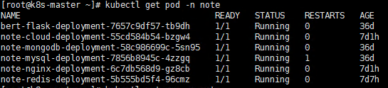

需确定 `mongodb`、 `mysql`所在的 `node`节点，命令如下：

```bash
kubectl get pod -n note -o wide
```

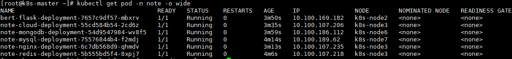

由上图可知， `mongodb`和 `mysql`的 `pod`分别被部署到了 `k8s-node6`、 `k8s-node7`节点。

## 2. 备份数据

问学长得知， `k8s-node6`、 `k8s-node7`节点位于 `122`服务器

远程连接 `122`服务器后，打开 `VMWare Workstation Pro`，登录 `node6`节点：

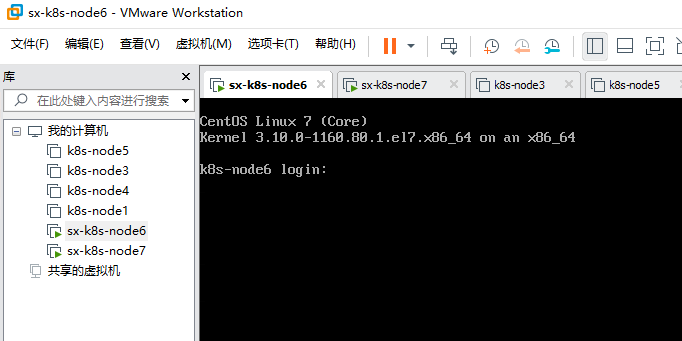

账号密码为 `root 123456`，登陆后如下：

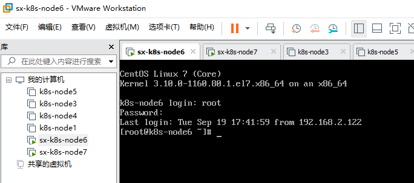

按下面命令将数据拷贝到 `tmp/backup`文件夹下进行备份：

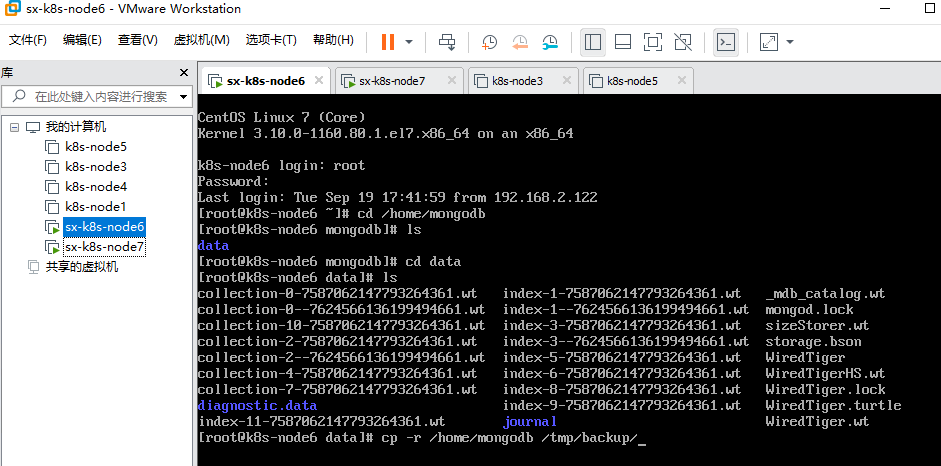

对 `node7`下的 `mysql`进行同样操作，不再赘述。

为了保险起见，使用 `xShell`中的 `xftp`将备份的文件再备份到桌面一份：

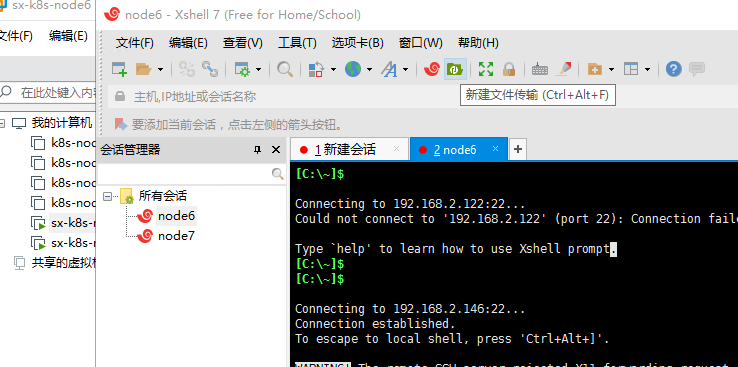

打开 `xshell`点击新建文件传输，将 `/home`下的 `mongodb`文件夹拖动到桌面。

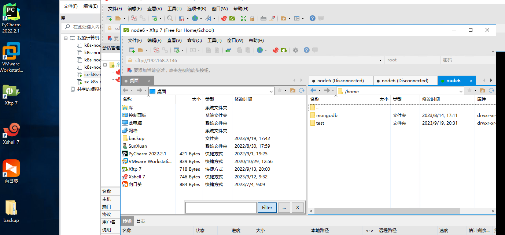

对 `node7`下的 `mysql`进行同样操作，不再赘述。

## 3. 删除旧的pod

删除旧的 `pod`：

```yaml
kubectl delete -f note-mysql-pvc.yaml -n note
kubectl delete -f note-mysql.yaml -n note
kubectl delete -f note-mongodb-pvc.yaml -n note
kubectl delete -f note-mongodb.yaml -n note
```

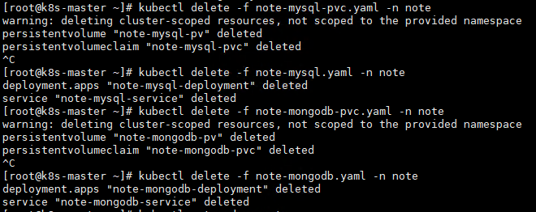

此时查看 `pod`结果：

```yaml
kubectl get pod -n note
```

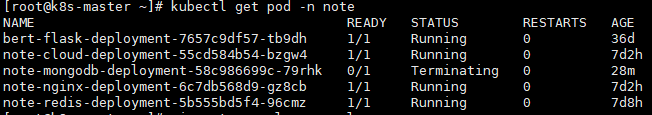

`mongodb`和 `mysql`的 `pod`已经被删掉。

## 4. 修改pv、pvc

将相关的 `yaml`文件修改为如下内容：

`note-mongodb-pvc.yaml`

```yaml
apiVersion: v1
kind: PersistentVolume
metadata:
  name: note-mongodb-pv
spec:
  capacity:
    storage: 50Gi
  accessModes:
    - ReadWriteOnce
  hostPath:
    path: /home/mongodb/data # 主机上的数据存储路径
---
apiVersion: v1
kind: PersistentVolumeClaim
metadata:
  name: note-mongodb-pvc
spec:
  accessModes:
    - ReadWriteOnce
  resources:
    requests:
      storage: 50Gi
  storageClassName: ""
  volumeName: note-mongodb-pv
```

`note-mysql-pvc.yaml`

```yaml
apiVersion: v1
kind: PersistentVolume
metadata:
  name: note-mysql-pv
spec:
  capacity:
    storage: 10Gi
  accessModes:
    - ReadWriteOnce
  hostPath:
    path: /home/mysql/data # 主机上的数据存储路径
---
apiVersion: v1
kind: PersistentVolumeClaim
metadata:
  name: note-mysql-pvc
spec:
  accessModes:
    - ReadWriteOnce
  resources:
    requests:
      storage: 10Gi
  storageClassName: ""
  volumeName: note-mysql-pv
```

`yaml`文件里已经将内存修改为目标内存。

## 5. 指定亲和性

这里的亲和性是 `Affinity`，指定了这个后会让其部署在指定标签的 `node`节点上。这样仅需将指定的 `node`节点的虚拟机扩容即可。

首先需要为 `node`节点添加标签。如下所示：

```bash
kubectl get nodes --show-labels

# 为节点6和7添加label
kubectl label nodes k8s-node6 notelabel=mongodb
kubectl label nodes k8s-node7 notelabel=mysql
```

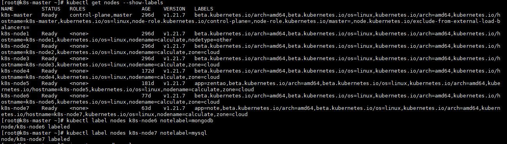

指定完标签就可以添加亲和性了，如下：

`note-mongodb-pvc.yaml`

```yaml
apiVersion: v1
kind: PersistentVolume
metadata:
  name: note-mongodb-pv
spec:
  capacity:
    storage: 50Gi
  accessModes:
    - ReadWriteOnce
  hostPath:
    path: /home/mongodb/data # 主机上的数据存储路径
  nodeAffinity:
    required:
      nodeSelectorTerms:
      - matchExpressions:
        - key: notelabel
          operator: In
          values:
          - mongodb
---
apiVersion: v1
kind: PersistentVolumeClaim
metadata:
  name: note-mongodb-pvc
spec:
  accessModes:
    - ReadWriteOnce
  resources:
    requests:
      storage: 50Gi
  storageClassName: ""
  volumeName: note-mongodb-pv
```

`note-mysql-pvc.yaml`

```yaml
apiVersion: v1
kind: PersistentVolume
metadata:
  name: note-mysql-pv
spec:
  capacity:
    storage: 10Gi
  accessModes:
    - ReadWriteOnce
  hostPath:
    path: /home/mysql/data # 主机上的数据存储路径
  nodeAffinity:
    required:
      nodeSelectorTerms:
      - matchExpressions:
        - key: notelabel
          operator: In
          values:
          - mysql
---
apiVersion: v1
kind: PersistentVolumeClaim
metadata:
  name: note-mysql-pvc
spec:
  accessModes:
    - ReadWriteOnce
  resources:
    requests:
      storage: 10Gi
  storageClassName: ""
  volumeName: note-mysql-pv
```

`note-mongodb.yaml`

```yaml
apiVersion: apps/v1
kind: Deployment
metadata:
  name: note-mongodb-deployment
spec:
  replicas: 1
  selector:
    matchLabels:
      app: note-mongodb-pod
  template:
    metadata:
      labels:
        app: note-mongodb-pod
    spec:
      affinity:
        nodeAffinity:
          requiredDuringSchedulingIgnoredDuringExecution:
            nodeSelectorTerms:
            - matchExpressions:
              - key: notelabel
                operator: In
                values:
                - mongodb
      containers:
        - name: note-mongodb
          image: registry.cn-hangzhou.aliyuncs.com/lucas-njfu/note-mongodb:v1.1.0
          imagePullPolicy: IfNotPresent
          ports:
            - containerPort: 27017
          env:
            - name: MONGO_INITDB_ROOT_USERNAME
              value: admin
            - name: MONGO_INITDB_ROOT_PASSWORD
              value: 5c8b18289f7848e9b0af98e81562649d
          volumeMounts:
            - name: note-mongodb-persistent-storage
              mountPath: /data/db
      volumes:
        - name: note-mongodb-persistent-storage
          persistentVolumeClaim:
            claimName: note-mongodb-pvc
---
apiVersion: v1
kind: Service
metadata:
  name: note-mongodb-service
spec:
  selector:
    app: note-mongodb-pod
  type: NodePort # service类型
  ports:
  - port: 27017
    nodePort: 30017 # 指定绑定的node的端口(默认的取值范围是：30000-32767),如果不指定，会默认分配
    targetPort: 27017
```

`note-mysql.yaml`

```yaml
apiVersion: apps/v1
kind: Deployment
metadata:
  name: note-mysql-deployment
spec:
  replicas: 1
  selector:
    matchLabels:
      app: note-mysql-pod
  template:
    metadata:
      labels:
        app: note-mysql-pod
    spec:
      affinity:
        nodeAffinity:
          requiredDuringSchedulingIgnoredDuringExecution:
            nodeSelectorTerms:
            - matchExpressions:
              - key: notelabel
                operator: In
                values:
                - mysql
      containers:
        - name: note-mysql
          image: registry.cn-hangzhou.aliyuncs.com/lucas-njfu/note_mysql:v1.1.0
          imagePullPolicy: IfNotPresent
          env:
            - name: MYSQL_ROOT_PASSWORD
              value: dfa6f1b032ee42ed95d12647225f2ff4
          ports:
            - containerPort: 3306
          volumeMounts:
            - name: note-mysql-persistent-storage
              mountPath: /var/lib/mysql
      volumes:
        - name: note-mysql-persistent-storage
          persistentVolumeClaim:
            claimName: note-mysql-pvc # 使用之前创建的持久卷声明
---
apiVersion: v1
kind: Service
metadata:
  name: note-mysql-service
spec:
  selector:
    app: note-mysql-pod
  type: NodePort # service类型
  ports:
  - port: 3306
    nodePort: 30006 # 指定绑定的node的端口(默认的取值范围是：30000-32767), 如果不指定，会默认分配
    targetPort: 3306
```

这样，亲和性就修改完毕了。

## 6. 重新部署相应的pod

接下来按 `5. 指定亲和性` 所修改的 `yaml`重新进行 `pod`部署：

```yaml
kubectl create -f note-mysql-pvc.yaml -n note
kubectl create -f note-mysql.yaml -n note
kubectl create -f note-mongodb-pvc.yaml -n note
kubectl create -f note-mongodb.yaml -n note
```

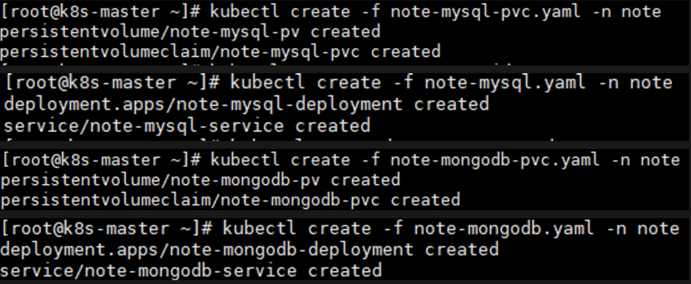

查看部署的结果：

```yaml
kubectl get pod -n note -o wide
```

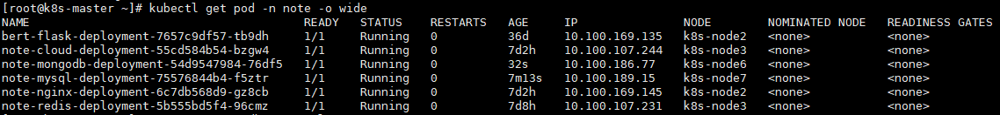

可以看到已经将 `mongodb`和 `mysql`分别部署到了节点 `6`和 `7`上。

## 7. 扩容节点的虚拟机

远程连接 `122`服务器后，打开 `VMWare Workstation Pro`，如下：


对于 `sx-k8s-node6`，先双击，然后点击上面的橙色运行按钮右边的下拉倒三角，关机。

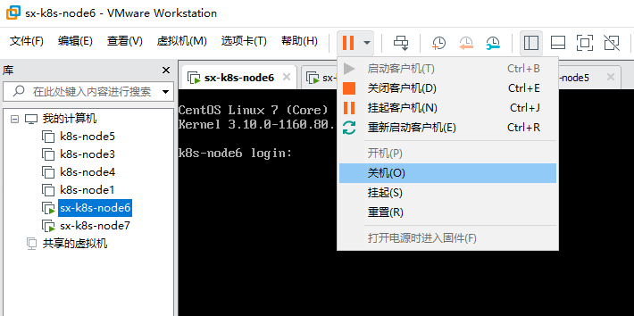

然后右键 `sx-k8s-node6`，点设置

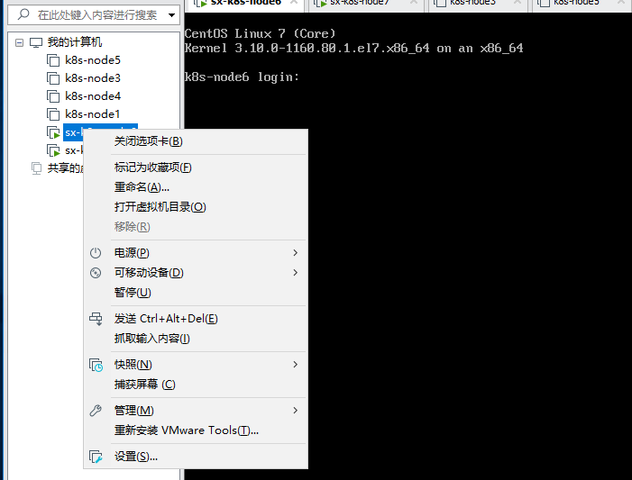

点击硬盘后点击右下角扩展

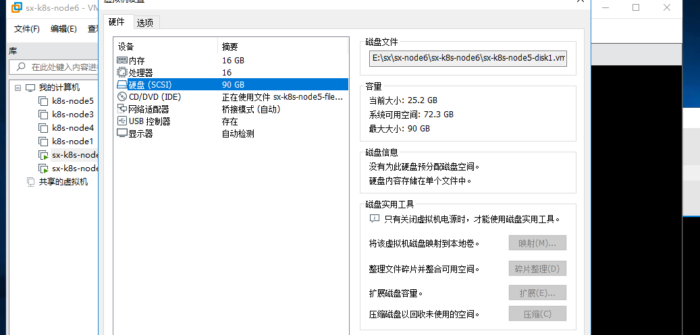

对硬盘容量进行修改。

这里原本是 `40G`，我增加了 `50G`后变为了 `90G`。

`sx-k8s-node7`的操作类似，不再赘述。

此时打开网址，访问成功！扩容成功！

## 访问
访问(连校园网，关梯子)：

http://192.10.84.209:33395/cloudNote/

账号：姓名小写拼音

密码：123456

效果：

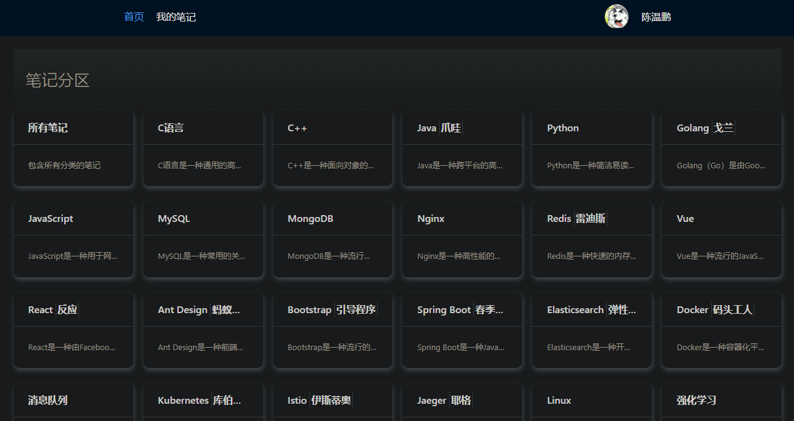
